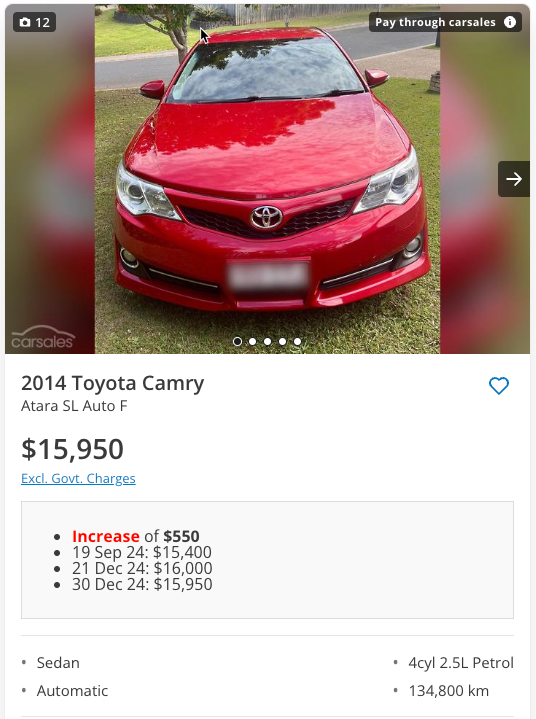

# Carsales Price History Tracker  

  
    

## Overview  

**Carsales Price History Tracker** is a consolidated set of Tampermonkey scripts AND/OR Chrome extension that enhances the Carsales browsing experience by providing price history insights for listings on both search results and saved items pages. Track price trends, detect reductions or increases, and make informed decisions directly within the Carsales platform.  

## Features  

- **Price History Integration:** Fetch and display detailed price history for Carsales listings.  
- **Search Results Enhancement:** Adds price history insights directly to search result listings.  
- **Saved Items Insights:** Displays price history for your saved Carsales listings in an easy-to-read format.  
- **Rate Limiting:** Avoids overwhelming Carsales servers with built-in delays and the dreaded "You are Blocked" message  

## Installation  

### Chrome extension - Web Store
1. Currently in review

### Chrome Extension - Manual
1. Install the extension to Chrome - [Download Extension](./extension/extension.crx)

### Tampermonkey
1. Add the relevant script into Tampermonkey - <a href="https://github.com/davesc63/carsales-price-history/blob/main/src/tampermonkey/"> Tampermonkey </a> - We recommend the "Consolidated" script 

## How It Works  

1. **Detect Listings:** The extension identifies Carsales listings on search results and saved items pages.  
2. **Fetch Data:** It queries the Carsales API to fetch detailed price history for each listing.  
3. **Display Insights:** Price history data, including trends and detailed breakdowns, is displayed inline for each listing.  

## Usage  

1. Navigate to Carsales search results or saved items pages.  
2. Let the extension process the listings (you’ll see logs in the console for tracking).  
3. Price history data will appear below each listing.  

## Usage - Stop / Start
1. Press the "Stop Price History" button to pause the processing. This is a helpful when you have a large amount of cars (search results / saved items) and you don't want to have it processing in the background non-stop

  
  

## Example  

Here’s an example of the data displayed for a listing:  

- **Price Reduction:** Decreased by **$500**.  
- **Timeline:**  
  - 01 Jan 2025: $20,000  
  - 15 Jan 2025: $19,500  

  
  

## Contributing  

Contributions are welcome! Please follow these steps:  

1. Fork this repository.  
2. Create a new branch for your feature or bug fix.  
3. Submit a pull request with a detailed description of the changes.  

## Roadmap  

- Add listing creation date (if possible)  
- Add notifications for significant price changes.  

## License  

This project is licensed under the MIT License. See [LICENSE](./LICENSE) for details.  

## Acknowledgements  

- Noahostle and their Chrome Extension as inspiration: https://chromewebstore.google.com/detail/carsales-price-history/hgehoofcdfnpkgjpfhgnnhajfofobpcj

- Special thanks to the Carsales platform for the data insights.  
- Inspired by the need for better car-buying decisions!  

---  

**Note:** This extension is a personal project and is not affiliated with Carsales.  
